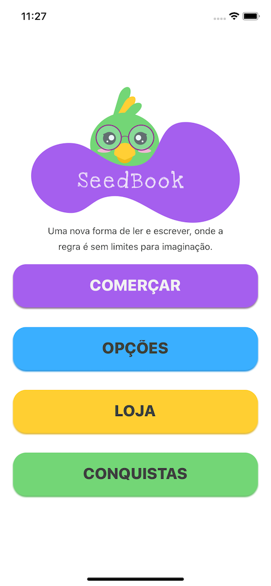
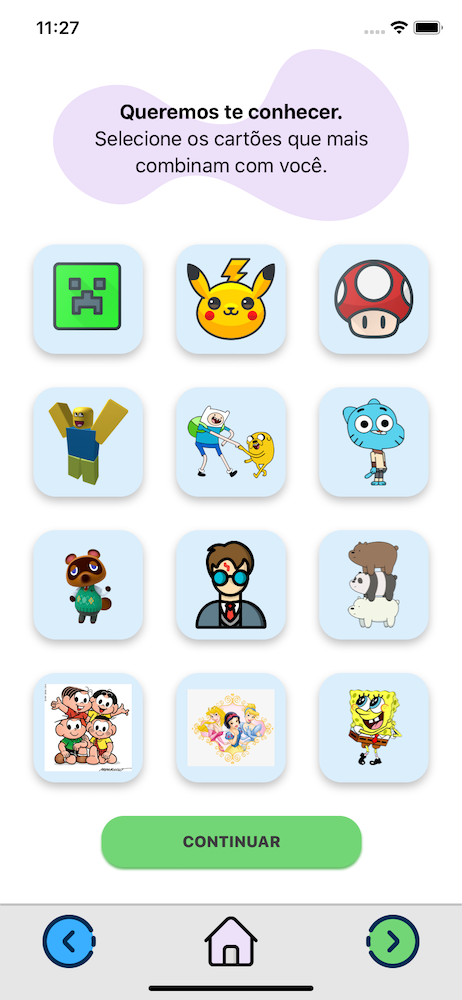
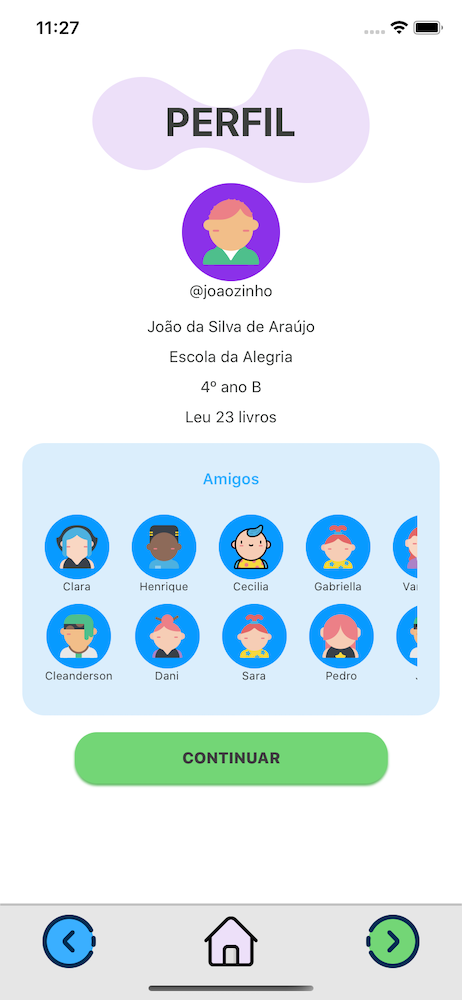
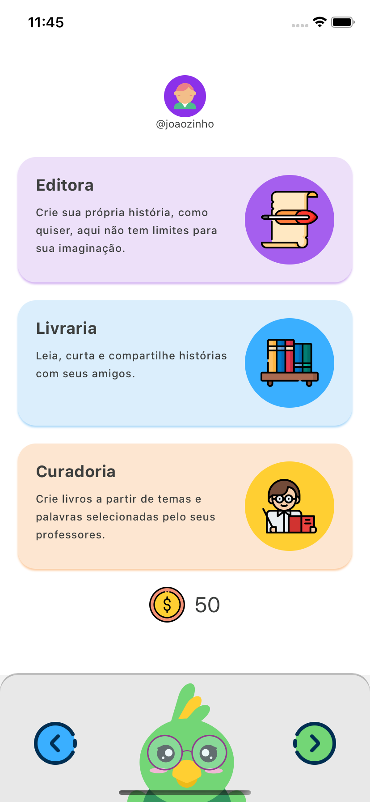
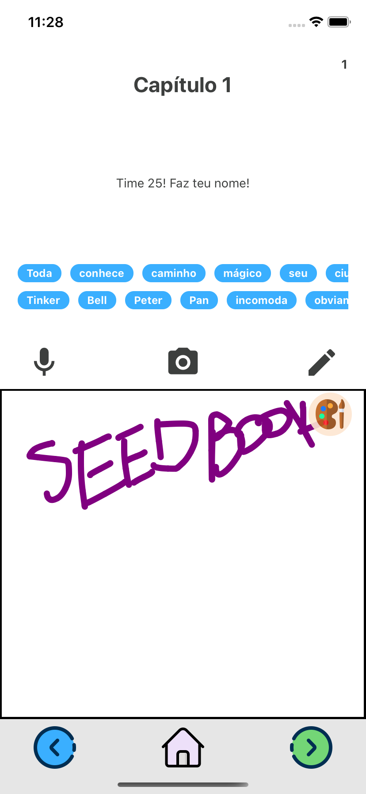
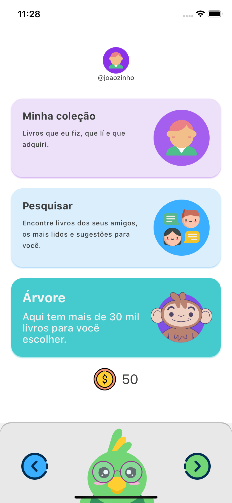
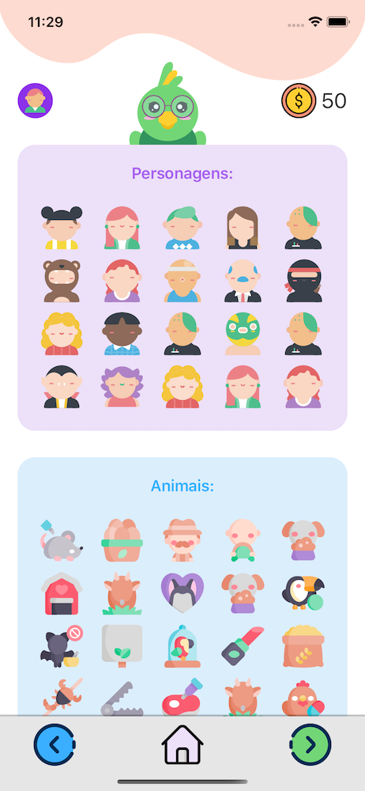

# seedbook

  

  <h2 align="center">
   <b>SeedBook</b>
  </h2>
  

  Uma nova forma de ler e escrever, onde a regra é sem limites para imaginação.
  

  <a href="https://youtu.be/lx43uIKz6qo"> Demo + Pitch
  

## Libraries and tools

* TypeScript
* React Navigation v5
* Redux
* Redux Saga
* Styled Components
* Axios
* React Navigation

## Screenshots

### Inicio

  

### Traçando Perfil

  

### Perfil

  

### Opções

  

### Editora/Curadoria
Area que o aluno/usuário pode criar seus livros com um branco de palavras baseados no livros que o professor passou ou dos seus gostos.

  

### Livraria

  

### Loja
Usuário pode comprar personagens, personagens para usar nos livros.

  

## Show Support
* [Recommend Me On LinkedIn](https://www.linkedin.com/in/cleandersonlobo/) - I will realy Appriciate this
* Don't forget to star ⭐ the repo 😉, it's FREE.

## Author

[Cleanderson Lobo](https://www.linkedin.com/in/cleandersonlobo/)