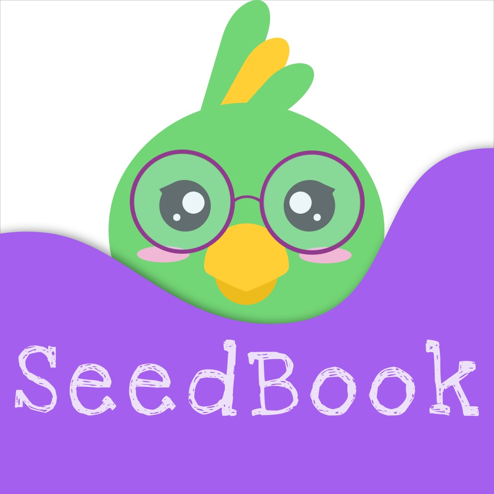

# Seedbook

  

  <h2 align="center">
   <b>SeedBook</b>
  </h2>
  

  Uma nova forma de ler e escrever, onde a regra é sem limites para imaginação.
  

  <a href="https://youtu.be/lx43uIKz6qo"> Video - Demo App
  

  <a href="https://testflight.apple.com/join/vJ2ulykv"> TestFlight - iOS
  

  <a href="./apk/app-seedbook.apk"> APK - Android
  

--------
## MegaHack 3: Team 25

### Desafio escolhido: Árvore Educação

> Objetivo: engajar os leitores a lerem mais.

    

## Team 25
* [Cleanderson Lobo](https://www.linkedin.com/in/cleandersonlobo/?originalSubdomain=br) - Frontend
* [Daniel Moura](https://www.linkedin.com/in/daniel-m-araujo/) - Business
* [Daniella Grimberg](https://www.linkedin.com/in/daniella-grimberg-139a9614b/?originalSubdomain=br) - Backend 
* [Laura Fiuza](https://www.linkedin.com/in/laura-fiuza-ba1077b4/) - Backend
* [Sara Margarido](https://www.linkedin.com/in/saramargarido/?originalSubdomain=br) - UI/UX Design

## Libraries and tools

* TypeScript
* React Navigation v5
* React Canvas;
* Styled Components
* Axios
* React Navigation
* API Rest

## Project Technologies
* React Native;
* Strapi;
* NodeJS;
* MongoDB;
* S3 AWS

### Demo - Editora

  

## Screenshots

### Home

  

### Traçando Perfil

  

### Perfil

  

### Opções

  

### Editora/Curadoria
Area que o aluno/usuário pode criar seus livros com um branco de palavras baseados no livros que o professor passou ou dos seus gostos.

  

### Palheta Ferramentas para Desenhar

  

### Livraria

  

### Loja
Usuário pode comprar personagens, personagens para usar nos livros.

  

### Conquistas

  

### Dark Theme

  

## Links

[SendBook - API](https://github.com/danigrim/megaHack3)

[SendBook - Landing Page](https://saramargarido.github.io/megahack3/)

## Show Support
* [Recommend Me On LinkedIn](https://www.linkedin.com/in/cleandersonlobo/) - I will realy Appriciate this
* Don't forget to star ⭐ the repo 😉, it's FREE.

## Author

[Cleanderson Lobo](https://www.linkedin.com/in/cleandersonlobo/)
